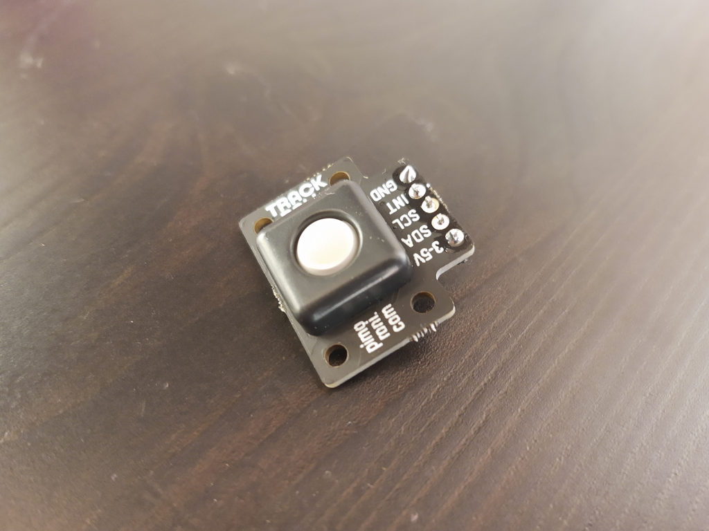

# pimoroni-trackball
An Arduino library for the [Pimoroni RGBW trackball breakout](https://shop.pimoroni.com/products/trackball-breakout), as shown below.

## Connections

These trackballs communicate over I2C and optionally provide an interrupt you can use to trigger events. This library does not yet support interrupts and callbacks but may in the future.

## Methods

### void begin([I2C address = 0x0A],[I2C port = Wire])

Initialises and starts the breakout. By default assumes I2C address 0x0A, which is the default I2C address for the breakout  and the I2C port 'Wire'. If you supply an argument you can set it to a different address and optionally I2C interface.

### bool isConnected()

Returns true if the trackball breakout is detected as connected.

### bool changed()

Reads the current state of the trackball and returns true if it has changed since the last read.

### uint8_t left()

How far left the trackball has moved. Note this resets on reading, it does not constantly increase.

### uint8_t right()

How far right the trackball has moved. Note this resets on reading, it does not constantly increase.

### uint8_t up()

How far up the trackball has moved. Note this resets on reading, it does not constantly increase.

### uint8_t down()

How far down the trackball has moved. Note this resets on reading, it does not constantly increase.

### bool click()

Returns true if the trackball is clicked. Note this resets on reading and does not stay true while the ball is held down.

### bool release()

Returns true if the trackball is released. Note this resets on reading and does not stay true while the ball is not held down.

### void setRGBW(uint8_t redBrightness, uint8_t greenBrightness, uint8_t blueBrightness, uint8_t 

### whiteBrightness)

Sets all the LEDs in the trackball in one function.

### void setRed(uint8_t redBrightness)

Sets the red LED brightness.

### void setGreen(uint8_t greenBrightness)

Sets the green LED brightness.

### void setBlue(uint8_t blueBrightness)

Sets the blue LED brightness.

### void setWhite(uint8_t whiteBrightness)

Sets the white LED brightness.

